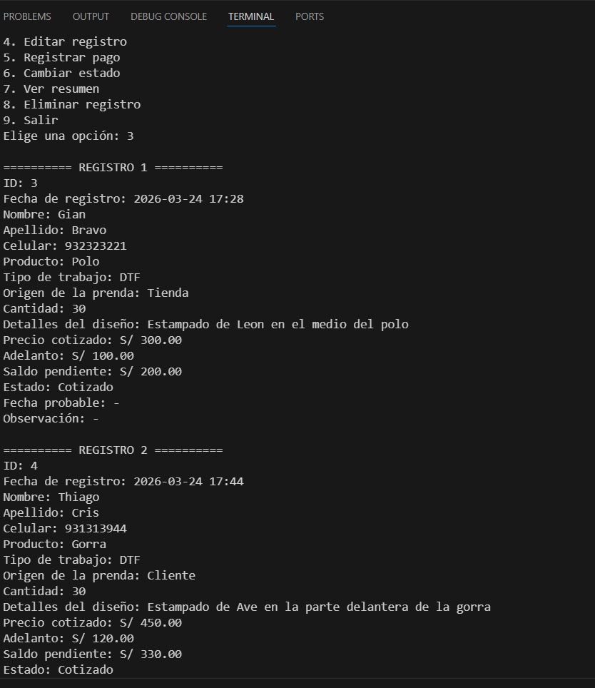

# Gestor de pedidos en Python

Sistema desarrollado en Python para registrar cotizaciones, gestionar pedidos y controlar pagos en un negocio de ropa personalizada.

## Funcionalidades
- Registrar nuevas cotizaciones
- Buscar clientes por nombre, celular o ID
- Editar registros
- Registrar pagos
- Cambiar estado de pedidos
- Ver resumen de ventas
- Eliminar registros
- Guardar datos en JSON

## Tecnologías usadas
- Python
- JSON
- datetime

## Objetivo del proyecto

Este proyecto fue desarrollado como una solución para digitalizar el proceso de cotización y seguimiento de pedidos en un negocio real de ropa personalizada.

Permite organizar pedidos, controlar pagos y hacer seguimiento del estado de producción, resolviendo problemas comunes como la desorganización de pedidos y la falta de control financiero.

## Mejoras futuras
- Interfaz gráfica
- Versión web
- Base de datos

## Cómo usar el programa

1. Ejecutar el archivo en Python
2. Elegir una opción del menú
3. Registrar una nueva cotización
4. Buscar, editar o actualizar el estado de pedidos

El sistema permite llevar control completo de pedidos y pagos desde la terminal.

## Ejemplo de uso

## English version

This project is a Python-based system for managing orders in a custom clothing business.

Features:
- Register new orders
- Search customers by name, phone, or ID
- Edit records
- Track payments
- Change order status
- View business summary

This project was built as part of my portfolio, applying programming to a real-world business case.
